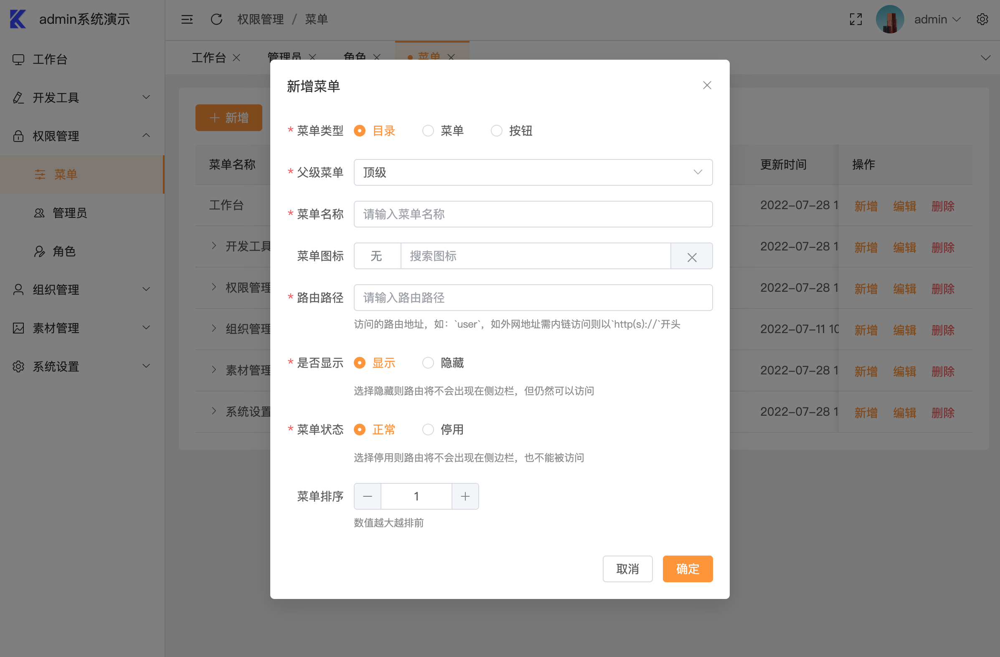
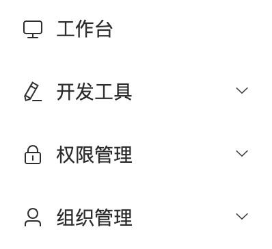
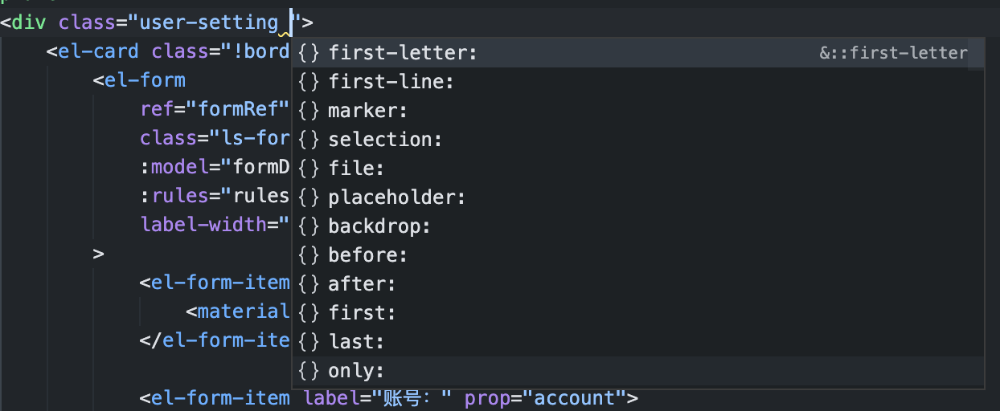
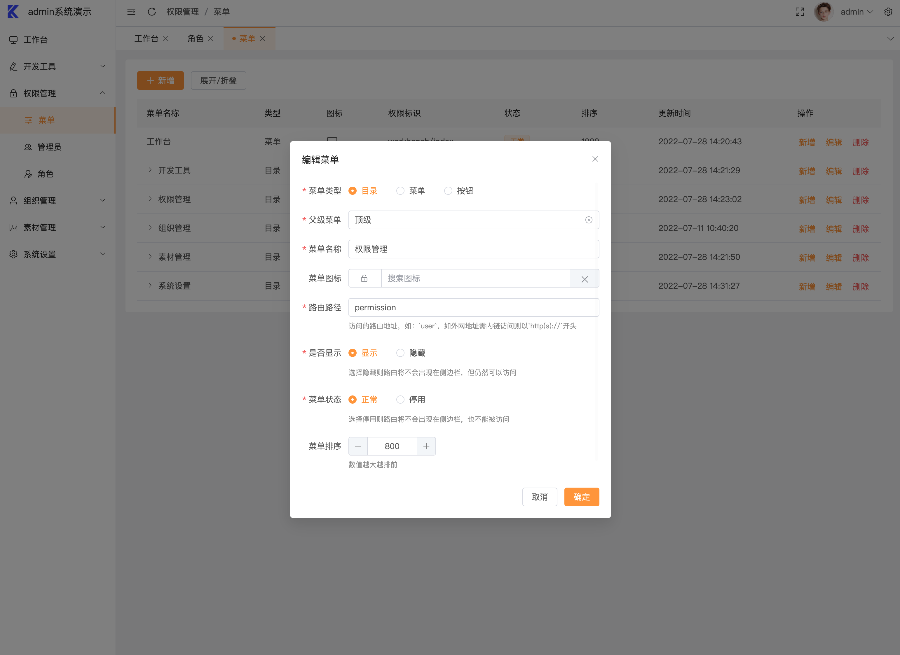
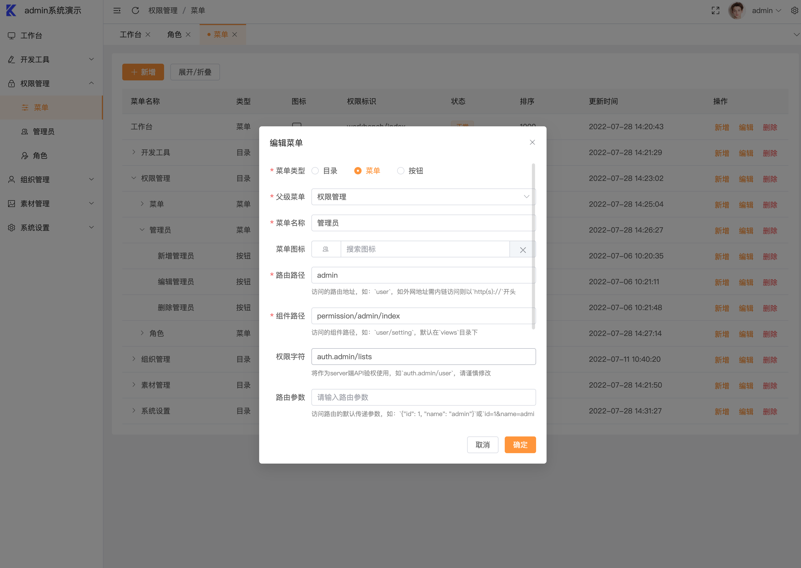
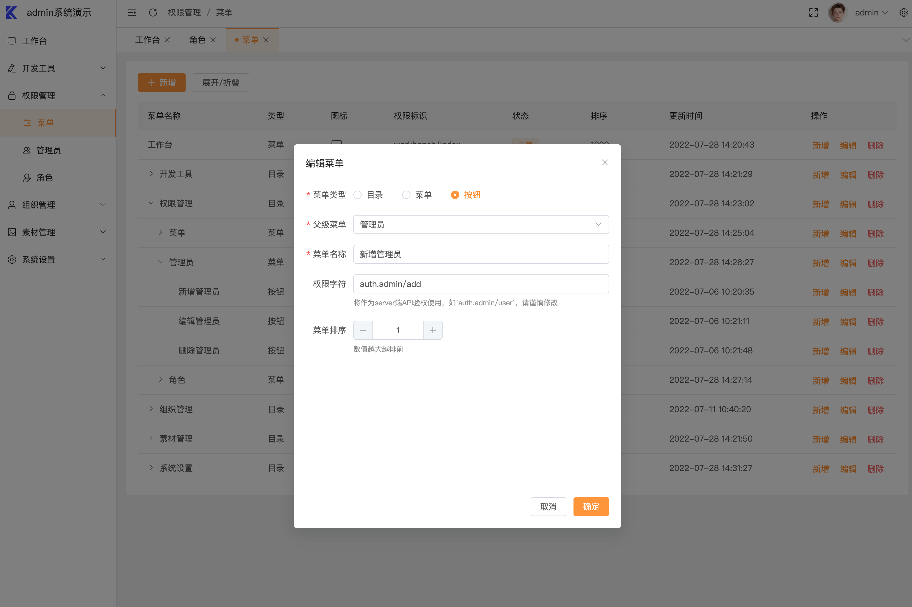

= Vue admin 项目

== 准备环境

首先需要在本地安装 https://nodejs.org/en/[node]，推荐 node 的版本14+、16+、18+。

编辑器推荐使用 Visual Studio Code，编辑器插件推荐安装 https://marketplace.visualstudio.com/items?itemName=dbaeumer.vscode-eslint[ESLint]、 https://marketplace.visualstudio.com/items?itemName=rvest.vs-code-prettier-eslint[Prettier ESLint]、 https://marketplace.visualstudio.com/items?itemName=bradlc.vscode-tailwindcss[Tailwind CSS IntelliSense]、 https://marketplace.visualstudio.com/items?itemName=Vue.volar[Vue Language Features (Volar)]、 https://marketplace.visualstudio.com/items?itemName=Vue.vscode-typescript-vue-plugin[TypeScript Vue Plugin (Volar)]

== 项目规范

本项目中使用了 eslint 去检查代码规范，使用 prettier 去格式化代码。

=== 编辑器自动校验

使用 vscode 进行开发，可以搭配 vscode 的一些插件，实现自动修改一些错误，同时项目中也自带了 vscode 的一些配置，在 .vscode/setting.json 文件中。注意：要自动修复错误需要使用 vscode 打开 admin 文件夹才行。

如果使用 vscode 格式化后还是出现很多 eslint 错误，有可能是格式化程序设置有误，只需要设置默认的格式化程序为 Prettier ESLint 即可。

=== 手动校验代码

执行命令：

[source, bash]
----
npm run lint
----

== 目录结构

[source, bash]
----
├──📂 .vscode                          # vscode配置文件
├──📂 scripts                          # js脚本
├──📂 src                              # 源代码
│  ├──📂 api                           # 所有请求
│  ├──📂 assets                        # 字体，图片等静态资源
│  ├──📂 components                    # 全局公用组件
│  ├──📂 config                        # 配置相关
│  ├──📂 enums                         # 全局枚举
│  ├──📂 hooks                         # 全局hook
│  ├──📂 install                       # 插件安装及自定义指令组册
│  ├──📂 layout                        # 布局组件
│  ├──📂 router                        # 路由
│  ├──📂 stores                        # 全局状态管理
│  ├──📂 styles                        # 全局样式
│  ├──📂 utils                         # 全局公用方法
│  ├──📂 views                         # 所有页面
│  ├── App.vue                         # 入口页面
│  ├── main.ts                         # 入口文件 初始化，组册插件等
│  └── permission.ts                   # 路由拦截，权限管理
├──📂 typings                          # ts声明文件
├── .env.xxx                           # 环境变量配置
├── .eslintrc.cjs                      # eslint 配置项
├── package.json                       # package.json
├── postcss.config.js                  # postcss 配置项
├── tailwind.config.js                 # tailwindcss 配置项
├── tsconfig.json                      # ts 配置项
├── vite.config.ts                     # vite 配置项
----

== 配置项

=== 环境变量

- 变量命名规则：需要以 VITE_ 为前缀的
- 如何使用：import.meta.env.VITE_

更多细节见 https://vitejs.cn/guide/env-and-mode.html#env-variables[环境变量] 。

+.env.development+:: 开发环境适用
+
[source, bash]
----
NODE_ENV = 'development'

# 请求域名
VITE_APP_BASE_URL='https://likeadmin-java.yixiangonline.com'
----

+.env.production+:: 生产环境适用
+
[source, bash]
----
NODE_ENV = 'production'

# 请求域名
VITE_APP_BASE_URL=''  //填空则跟着网站的域名来请求
----

=== 系统配置项

路径：src/config/index.ts，说明如下：

[source, javascript]
----
const config = {
    terminal: 1, //终端
    title: '后台管理系统', //网站默认标题
    version: '1.2.1', //版本号
    baseUrl: `${import.meta.env.VITE_APP_BASE_URL}/`, //请求接口域名
    urlPrefix: 'adminapi', //请求默认前缀
    timeout: 10 * 1000 //请求超时时长
}
----

=== 主题配置项

修改系统默认的主题 路径：src/config/setting.ts，说明如下：

[source, javascript]
----
const defaultSetting = {
    sideWidth: 200, //侧边栏宽度
    sideTheme: 'light', //侧边栏主题
    sideDarkColor: '#1d2124', //侧边栏深色主题颜色
    theme: '#4A5DFF', //主题色
    successTheme: '#67c23a', //成功主题色
    warningTheme: '#e6a23c', //警告主题色
    dangerTheme: '#f56c6c', //危险主题色
    errorTheme: '#f56c6c', //错误主题色
    infoTheme: '#909399' //信息主题色
}
//以上各种主题色分别对应element-plus的几种行为主题
----

== 路由

目前路由分为两部分，一部分是静态路由：src/router/routes.ts，一部分是动态路由：在系统中的菜单中添加的，需要根据菜单权限加载。

=== 路由配置说明

[source, javascript]
----
path: '/path'                      // 路由路径
name:'router-name'                 // 设定路由的名字
meta : {
    title: 'title'                  // 设置该路由在侧边栏的名字
    icon: 'icon-name'                // 设置该路由的图标
    activeMenu: '/system/user'      // 当路由设置了该属性，则会高亮相对应的侧边栏。
    query: '{"id": 1}'             // 访问路由的默认传递参数
    hidden: true                   // 当设置 true 的时候该路由不会在侧边栏出现
    hideTab: true                   //当设置 true 的时候该路由不会在多标签tab栏出现
}
component: () => import('@/views/user/setting.vue')  // 路由组件
----

=== meta配置ts扩展

[source, typescript]
.typings/router.d.ts
----
import 'vue-router'

/**
 * 扩展 Vue Router 的 RouteMeta 接口
 * 添加自定义的元字段，用于路由配置
 */
declare module 'vue-router' {
    // 扩展 RouteMeta
    interface RouteMeta {
        /**
         * 路由的类型
         */
        type?: string
        /**
         * 路由所需的权限
         */
        perms?: string
        /**
         * 路由的标题，通常用于显示在导航栏或面包屑中
         */
        title?: string
        /**
         * 路由的图标，通常用于导航栏
         */
        icon?: string
        /**
         * 是否隐藏该路由，不显示在侧边导航栏中
         */
        hidden?: boolean
        /**
         * 激活菜单时高亮显示侧边栏导航栏的菜单项
         */
        activeMenu?: string
        /**
         * 是否在多标签Tab栏隐藏标签页
         */
        hideTab?: boolean
        /**
         * 是否使用 keep-alive 缓存该路由组件
         */
        keepAlive?: boolean
    }
}
----

=== 静态路由

[source, typescript]
.src/router/routes.ts
----
export const constantRoutes: Array<RouteRecordRaw> = [
    {
        path: PageEnum.ERROR_404,
        component: () => import('@/views/error/404.vue')
    },
    {
        path: PageEnum.ERROR_403,
        component: () => import('@/views/error/403.vue')
    },
    {
        path: PageEnum.LOGIN,
        component: () => import('@/views/account/login.vue')
    },
    //多级路由：LAYOUT布局
    {
        path: '/user',
        component: LAYOUT,
        children: [
            {
                path: 'setting',
                component: () => import('@/views/user/setting.vue'),
                meta: {
                    title: '个人设置'
                }
            }
        ]
    },
    {
        path: '/dev_tools',
        component: LAYOUT,
        children: [
            {
                path: 'code/edit',
                component: () => import('@/views/dev_tools/code/edit.vue'),
                meta: {
                    title: '编辑数据表',
                    activeMenu: '/dev_tools/code'
                }
            }
        ]
    },
    {
        path: '/setting',
        component: LAYOUT,
        children: [
            {
                path: 'dict/data',
                component: () => import('@/views/setting/dict/data/index.vue'),
                meta: {
                    title: '数据管理',
                    activeMenu: '/setting/dict'
                }
            }
        ]
    }
    //要添加路由可直接在这里加
]
----

=== 动态路由

如何添加一个动态路由：详见下面的菜单

== 菜单

菜单的渲染完全由服务端返回的数据控制，如何添加一个菜单：

在系统的 权限管理>菜单>新增，按照提示输入便可添加菜单



菜单经过前端转化为路由动态插进路由表中

菜单有三种类型：

[source, typescript]
----
export enum MenuEnum {
    CATALOGUE = 'M', //目录
    MENU = 'C', //菜单
    BUTTON = 'A' //按钮
}
----

- 目录：不会渲染具体的页面，下图中所有含有小三角图标的都为目录
- 菜单：菜单代表着具体的页面，下图的工作台即为一个菜单
+

- 按钮：用于按钮级别的权限控制

== 权限

系统中有两种权限控制方式

- 根据后台返回的菜单，动态生成路由表，实现对页面的权限控制
- 根据后台返回的权限列表，控制到具体每个页面的按钮的显示隐藏

页面级别的权限：服务端通过登录的管理员的角色权限过滤掉没有权限的菜单，前端拿到过滤好的菜单，经过一系列转化，动态生成路由表，没有权限的页面将不会注册在路由中，最终实现的页面级别的权限控制。

按钮级别的权限：服务端返回该管理员的权限列表，前端拿到权限列表后，通过自定义指令 v-perms 对每个按钮的权限进行比对，如果按钮对应的权限在返回的权限列表中，则显示该菜单，反之则隐藏。

控制按钮权限说明：

[source, html]
----
// auth.admin/edit 需要与添加菜单时的权限字符一致，一般对应服务端的api接口
<el-button v-perms="['auth.admin/edit']">编辑</el-button>
//多个控制一个按钮
<el-button v-perms="['auth.admin/edit','auth.admin/add']">编辑</el-button>
----

== 接口请求

系统中使用 axios 这个库来发起请求，并对其进行了更深一步的封装。

[source, bash]
.src/utils/request
----
├──📂 request
│  ├── axios.ts    # 封装的axios实例
│  ├── cancel.ts   # 封装的取消重复请求实例
│  ├── index.ts    # 接口返回统一处理及默认配置
│  ├── type.d.ts   # 类型声明文件
----

一般只需要修改 index.ts 文件，其他文件无需修改。

index.ts 文件说明:

=== 默认配置

[source, typescript]
----
const defaultOptions: AxiosRequestConfig = {
    //接口超时时间
    timeout: configs.timeout,
    // 基础接口地址
    baseURL: configs.baseUrl,
    //请求头
    headers: { 'Content-Type': ContentTypeEnum.JSON, version: configs.version },
    // 处理 axios的钩子函数
    axiosHooks: axiosHooks,
    // 每个接口可以单独配置
    requestOptions: {
        // 是否将params视为data参数，仅限post请求
        isParamsToData: true,
        //是否返回默认的响应
        isReturnDefaultResponse: false,
        // 需要对返回数据进行处理
        isTransformResponse: true,
        // 接口拼接地址
        urlPrefix: configs.urlPrefix,
        // 忽略重复请求
        ignoreCancelToken: false,
        // 是否携带token
        withToken: true,
        // 开启请求超时重新发起请求请求机制
        isOpenRetry: true,
        // 重新请求次数
        retryCount: 2
    }
}
----

=== 请求拦截器配置

[source, typescript]
----
const axiosHooks: AxiosHooks = {
    requestInterceptorsHook(config) {
        NProgress.start()
        const { withToken, isParamsToData } = config.requestOptions
        const params = config.params || {}
        const headers = config.headers || {}

        // 添加token
        if (withToken) {
            const token = getToken()
            headers.token = token
        }
        // POST请求下如果无data，则将params视为data
        if (
            isParamsToData &&
            !Reflect.has(config, 'data') &&
            config.method?.toUpperCase() === RequestMethodsEnum.POST
        ) {
            config.data = params
            config.params = {}
        }
        config.headers = headers
        return config
    },
    requestInterceptorsCatchHook(err) {
        NProgress.done()
        return err
    },
    async responseInterceptorsHook(response) {
        NProgress.done()
        const { isTransformResponse, isReturnDefaultResponse } = response.config.requestOptions

        //返回默认响应，当需要获取响应头及其他数据时可使用
        if (isReturnDefaultResponse) {
            return response
        }
        // 是否需要对数据进行处理
        if (!isTransformResponse) {
            return response.data
        }
        const { code, data, show, msg } = response.data
        switch (code) {
            case RequestCodeEnum.SUCCESS: //成功
                if (show) {
                    msg && feedback.msgSuccess(msg)
                }
                return data
            case RequestCodeEnum.FAIL: //失败
                if (show) {
                    msg && feedback.msgError(msg)
                }
                return Promise.reject(data)
            case RequestCodeEnum.LOGIN_FAILURE: //token过期
                clearAuthInfo()
                router.push(PageEnum.LOGIN)
                return Promise.reject()
            case RequestCodeEnum.OPEN_NEW_PAGE: //重定向打开页面
                window.location.href = data.url
                return data
            default:
                return data
        }
    },
    responseInterceptorsCatchHook(error) {
        NProgress.done()
        if (error.code !== AxiosError.ERR_CANCELED) {
            error.message && feedback.msgError(error.message)
        }
        return Promise.reject(error)
    }
}
----

=== 如何在单个接口中单独使用这些配置

[source, typescript]
----
// 配置
export function xxxx(data) {
    return request.post({
        url: 'xxx',
        header: {
            'Content-type': ContentTypeEnum.FORM_DATA
        },
        data
    }, {
        // 忽略重复请求
        ignoreCancelToken: true,
        // 开启请求超时重新发起请求请求机制
        isOpenRetry: false,
         // 需要对返回数据进行处理
        isTransformResponse: false,
    })
}
----

== 组件注册

使用了插件 https://github.com/antfu/unplugin-auto-import#readme[unplugin-auto-import]、 https://github.com/antfu/unplugin-vue-components[unplugin-vue-components]、 https://github.com/anncwb/vite-plugin-style-import/tree/master/#readme[vite-plugin-style-import]

写在 components 中的组件和 element-plus 的组件都是自动且按需引入的，不需要在组件中注册。

== 使用 Vue 插件

下面以 vue-router 为例子： 在 src/install/plugins 下面新建一个文件 router.ts：

[source, typescript]
----
// router.ts
import router from '@/router'
import type { App } from 'vue'

export default (app: App<Element>) => {
    app.use(router)
}
----

这样就完成了插件的注册，不需要将文件引入到 main.ts 。

== 新增自定义指令

下面以 v-perms 为例子： 在 src/install/directives 下面新建一个文件 perms.ts，指令名即为文件名：

[source, typescript]
----
// perms.ts
/**
 * perm 操作权限处理
 * 指令用法：
 *  <el-button v-perms="['auth.menu/edit']">编辑</el-button>
 */

import useUserStore from '@/stores/modules/user'

export default {
    mounted: (el: HTMLElement, binding: any) => {
        const { value } = binding
        const userStore = useUserStore()
        const permissions = userStore.perms
        const all_permission = '*'
        if (Array.isArray(value)) {
            if (value.length > 0) {
                const hasPermission = permissions.some((key: string) => {
                    return all_permission == key || value.includes(key)
                })

                if (!hasPermission) {
                    el.parentNode && el.parentNode.removeChild(el)
                }
            }
        } else {
            throw new Error('like v-perms="[\'auth.menu/edit\']"')
        }
    }
}
----

这样就完成一个自定义指令，不需要将文件引入到 main.ts 。

== 样式

项目中使用了 scss 作为预处理语言，同时也使用了 tailwindcss 。

样式文件位于 src/styles 下面：

[source, bash]
----
├──📂 styles
│  ├── dark.css       # 深色模式下的css变量
│  ├── element.scss   # 修改element-plus组件的样式
│  ├── index.scss     # 入口
│  ├── public.scss    #
│  ├── tailwind.css   # 引入tailwindcss样式表
│  ├── var.css        # css变量
----

=== tailwindcss

具体使用说明详见 https://tailwindcss.com/

在 vscode 中安装插件 Tailwind CSS IntelliSense，可以得到提示，如果没有提示出现，就按空格键。



tailwindcss 配置说明：

[source, typescript]
----
/** @type {import('tailwindcss').Config} */
module.exports = {
    content: ['./index.html', './src/**/*.{vue,js,ts,jsx,tsx}'],
    theme: {
        colors: {
            //白色
            white: 'var(--color-white)',
            //主题色
            primary: {
                DEFAULT: 'var(--el-color-primary)',
                'light-3': 'var(--el-color-primary-light-3)',
                'light-5': 'var(--el-color-primary-light-5)',
                'light-7': 'var(--el-color-primary-light-7)',
                'light-8': 'var(--el-color-primary-light-8)',
                'light-9': 'var(--el-color-primary-light-9)',
                'dark-2': 'var(--el-color-primary-dark-2)'
            },
            //成功
            success: 'var(--el-color-success)',
            //警告
            warning: 'var(--el-color-warning)',
            //危险
            danger: 'var(--el-color-danger)',
            //危险
            error: 'var(--el-color-error)',
            //信息
            info: 'var(--el-color-info)',
            //body背景
            body: 'var(--el-bg-color)',
            //页面背景
            page: 'var(--el-bg-color-page)',
            //主要字体颜色
            'tx-primary': 'var(--el-text-color-primary)',
            //次要字体颜色
            'tx-regular': 'var(--el-text-color-regular)',
            //次次要字体颜色
            'tx-secondary': 'var(--el-text-color-secondary)',
            //占位字体颜色
            'tx-placeholder': 'var(--el-text-color-placeholder)',
            //禁用颜色
            'tx-disabled': 'var(--el-text-color-disabled)',
            //边框颜色
            br: 'var(--el-border-color)',
            //边框颜色-浅
            'br-light': 'var(--el-border-color-light)',
            //边框颜色-更浅
            'br-extra-light': 'var(--el-border-color-extra-light)',
            //边框颜色-深
            'br-dark': 'var( --el-border-color-dark)',
            //填充色
            fill: 'var(--el-fill-color)',
            //朦层颜色
            mask: 'var(--el-mask-color)'
        },
        fontFamily: {
            sans: ['PingFang SC', 'Arial', 'Hiragino Sans GB', 'Microsoft YaHei', 'sans-serif']
        },
        boxShadow: {
            DEFAULT: 'var(--el-box-shadow)',
            light: 'var(--el-box-shadow-light)',
            lighter: 'var(--el-box-shadow-lighter)',
            dark: 'var(--el-box-shadow-dark)'
        },
        fontSize: {
            xs: 'var(--el-font-size-extra-small)',
            sm: 'var( --el-font-size-small)',
            base: 'var( --el-font-size-base)',
            lg: 'var( --el-font-size-medium)',
            xl: 'var( --el-font-size-large)',
            '2xl': 'var( --el-font-size-extra-large)',
            '3xl': '20px',
            '4xl': '24px',
            '5xl': '28px',
            '6xl': '30px',
            '7xl': '36px',
            '8xl': '48px',
            '9xl': '60px'
        }
    },

    plugins: []
}
----

=== 页面、组件的样式

==== 开启scoped

没有加 scoped 属性，会污染全局样式。

[source, html]
----
<style scoped></style>
----

==== 样式穿透

开启 scoped 属性后需要如果需要将样式作用到子组件上，可以这样处理：

[source, html]
----
<style scoped>
:deep(.el-menu-item) {

}
</style>
----

在 Vue.js 的 <style scoped> 中，:deep() 是用于穿透组件作用域 CSS 的伪类选择器，专门用来处理子组件/第三方组件样式覆盖问题。

* 突破 Scoped CSS 限制，
默认情况下，Scoped CSS 会给父组件的所有选择器自动添加 [data-v-hash] 属性选择器（如 .el-menu-item[data-v-xxxx]），这使得父组件样式无法作用于子组件的根元素或深层元素。

* 实现样式穿透，
使用 :deep() 包裹子组件选择器时，Vue 编译器会将 [data-v-hash] 属性移至父级，从而让样式穿透到子组件内部元素。

== 使用本地存储

项目中对本地存储进行了封装，位于 src/utils/cache.ts，推荐使用时搭配 cacheEnums.ts 一起使用。

设置缓存：

[source, typescript]
----
// src/enums/cacheEnums.ts
export const TOKEN_KEY = 'token'

// xxx/xxx.ts
import { TOKEN_KEY } from '@/enums/cacheEnums'
cache.set(TOKEN_KEY, 'xxxx')
//带有时间的缓存
cache.set(TOKEN_KEY, 'xxxx', 10 * 12 *  3600) // 10 * 12 *  3600为缓存时间，单位为s
----

获取缓存：

[source, typescript]
----
import { TOKEN_KEY } from '@/enums/cacheEnums'
cache.get(TOKEN_KEY)
----

删除缓存：

[source, typescript]
----
import { TOKEN_KEY } from '@/enums/cacheEnums'
cache.remove(TOKEN_KEY)
----

清空缓存：

[source, typescript]
----
cache.clear()
----

== 图标

项目中对图标的使用进行了封装，位于 src/components/icon 文件夹内

目前有两种图标：

1. element-plus 带有的图标库。
2. 本地 svg 图标库

=== element-plus图标库

使用：

[source, vue]
----
// 官方
import { Edit } from '@element-plus/icons-vue'
<el-icon :size="20">
    <Edit />
</el-icon>

//推荐
<icon :size="20" name="el-icon-Edit" />
----

=== 本地图标库

本地图标库位于 src/assets/icons 内，如果需要添加 svg 图标，只需要将 svg 文件放到 src/assets/icons 中即可。如：copy.svg。

使用：

[source, vue]
----
<icon :size="20" name="local-icon-copy" />
----

== 如何添加一个页面

下面以管理员为例：

1. 在 view 中新建一个 permission 目录，代表是权限管理的模块,，然后在 permission 中新建 admin 目录，代表着管理员相关页面，新建 index.vue 文件和 edit.vue 文件，分别是管理员列表页面和编辑弹窗。
+
[source, bash]
----
├──📂 views
│  ├──📂 permission
│  │  ├──📂 admin
│  │  │  ├── index.vue    # 管理员列表页面
│  │  │  ├── edit.vue     # 编辑弹窗
----

2. 在系统中的 权限管理>菜单，点击 新增 按钮。

新增 permission 目录：



新增 admin 菜单：



新增管理员列表按钮：



如果说编辑的内容过多，需要将编辑弹窗做成一个页面，需要在 src/router/routes.ts 中添加路由。

[source, typescript]
----
// 在变量constantRoutes中添加
{
    path: '/permission',
    component: LAYOUT,
    children: [
        {
            path: 'admin/edit',
            component: () => import('@/views/permission/admin/edit.vue'),
            meta: {
                title: '管理员编辑',
                activeMenu: '/permission/admin' //管理员列表页面路由路径
            }
        }
    ]
}
----

== 黑暗主题

黑暗模式的原理是利用 css 变量和在 html 标签添加 class="dark" 实现，如果需要改黑暗模式的 css 变量可修改文件 src/styles/dark.css 。

组件中的字体颜色，背景颜色等颜色样式需要使用这些变量才能适配黑暗模式和正常模式

使用：

[source, vue]
----
//使用tailwindcss
<template>
    <div class="bg-body text-tx-regular">
        默认背景，次要字体样式
    </div>
</template>

//使用css变量
<template>
    <div class="example">
        默认背景，次要字体样式
    </div>
</template>
<style scoped>
.example {
    background-color: var(--el-bg-color-page);
    color: var(--el-text-color-regular);
}
</style>
----

== 额外知识

=== 在 TypeScript 中支持 `.vue` 文件的类型

默认情况下，TypeScript 无法处理 `.vue` 导入的类型信息，因此我们使用 `vue-tsc` 替换 `tsc` CLI 进行类型检查。在编辑器中，需要安装 link:https://marketplace.visualstudio.com/items?itemName=Vue.vscode-typescript-vue-plugin[TypeScript Vue Plugin (Volar)] 来让 TypeScript 语言服务识别 `.vue` 文件的类型。

如果您觉得独立的 TypeScript 插件不够快，Volar 还实现了一种更高效的 link:https://github.com/johnsoncodehk/volar/discussions/471#discussioncomment-1361669[Take Over Mode]。您可以通过以下步骤启用它：

. 禁用内置的 TypeScript 扩展
.. 在 VSCode 的命令面板中运行 `Extensions: Show Built-in Extensions`
.. 找到 `TypeScript and JavaScript Language Features`，右键点击并选择 `Disable (Workspace)`
. 在命令面板中运行 `Developer: Reload Window` 重新加载 VSCode 窗口

[NOTE]
====
代码块语法示例（非原文内容）：
[source,typescript]
----
// Vue 组件类型声明示例
declare module '*.vue' {
  import type { DefineComponent } from 'vue'
  const component: DefineComponent<Record<string, never>>
  export default component
}
----
====

=== 自定义配置

参考 [Vite 配置文档](https://vitejs.dev/config/)。

=== 项目使用

```sh
npm install
```

=== 开发环境编译和热重载

```sh
npm run dev
```

=== 类型检查、编译和生产环境压缩

```sh
npm run build
```

=== 使用 [ESLint](https://eslint.org/) 进行代码检查

```sh
npm run lint
```

=== 开发阶段配置

由于 cros 同源策略，存在两种方式绕过：

1. vite server 设置 proxy

   .env.development 文件中：

   ```json
   # 必须为空，表示和vite启动服务器同域名
   VITE_APP_BASE_URL=''
   ```
   vite.config.ts 文件中：
   ```json
    server: {
        host: '0.0.0.0',
        proxy: {
            // 将 `/api` 开头的请求代理到目标服务器
            '/admin_api': {
                target: 'http://demo.myadmin.com', // 目标服务器地址
                changeOrigin: true,              // 允许跨域
                rewrite: (path) => path,          // 不重写路径，保留 api 前缀
                // rewrite: (path) => path.replace(/^\/admin_api/, ''), // 路径重写，移除 `/api` 前缀
            },
        }
    },
   ```

2. tp 后端启用 cros 中间件

   app目录中 middleware.php 文件中
   
   ```php
   <?php
   // 全局中间件定义文件
   return [
       app\common\http\middleware\CorsAllowMiddleware::class,
       //基础中间件
       app\common\http\middleware\BaseMiddleware::class,
   ];
   ```
配置启动任何一种方式即可。

=== 测试账号

- 用户名 admin888
- 密码 admin888

=== 资源

- https://daisyui.com/
- https://tailwind-generator.com/
- https://tailwindcss.com/docs/colors